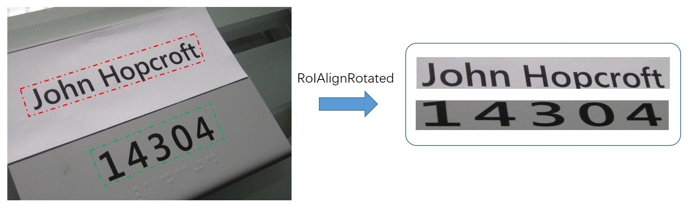
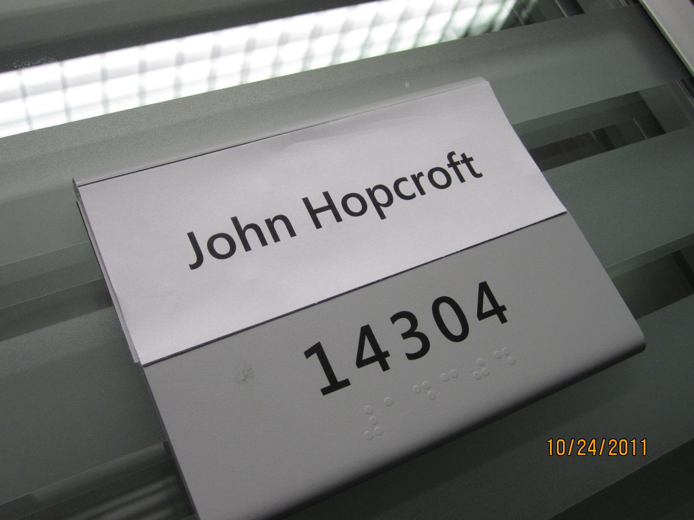

# RoIAlignRotated for Paddle

## 简介

RoIAlignRotated是旋转框版本的RoIAlign，功能是将旋转框中的特征提取出来。相比于RoIAlign，RoIAlignRotated多了一个角度参数，提取到的特征更加精确。该函数在遥感图像目标检测、文本检测领域使用较多，但是没有基于Paddle框架的实现，增加了基于Paddle复现论文的难度。

本项目实现了Paddle版本的RoIAlignRotated，底层C++使用了[MMCV](https://github.com/open-mmlab/mmcv)中提供的代码，支持CPU、GPU上的前向、反向计算。

[DRRG_Paddle](https://github.com/zhiminzhang0830/DRRG_Paddle)中使用了本项目，完成了复现工作。

## 使用
+ 环境配置：paddlepaddle-gpu >=2.3.1

+ 运行：

        import os
        import paddle
        import numpy as np
        import cv2

        from ext_op import RoIAlignRotated

        def main():
            img_root = './data'
            # batch_ind, x, y, w, h, angle
            rois = [[0, 760, 467, 740, 114, 0.319553],
                    [0, 940, 780, 500, 140, 0.379553],]
            imgs = [cv2.imread('data/IMG_1539.JPG')] # 读取输入图像
            # 设置gpu或cpu
            device = 'gpu:0' # cpu or gpu:0
            paddle.set_device(device)
            # 将数据迁移到对应的设备上
            imgs = paddle.to_tensor(imgs, dtype=paddle.float32, stop_gradient=False).transpose([0, 3, 1, 2])
            rois = paddle.to_tensor(rois, dtype=paddle.float32, stop_gradient=False)
            # 初始化RoIAlignRotated， 输出大小设置为h=100, w=800
            pool_fun = RoIAlignRotated(out_size=(100, 800), spatial_scale=1.0)
            # 前向推理
            output = pool_fun(imgs, rois)
            # 将输出结果保存
            output = output.transpose([0, 2, 3, 1])
            for i, out in enumerate(output):
                out = out.numpy().astype(np.uint8)
                cv2.imwrite('./data/result_{}.jpg'.format(i), out)

        if __name__ == '__main__':
            main()
    + 输入图像：
        

        
        

    + 输出结果：
        

        
        
        

+ 接口与[MMCV](https://github.com/open-mmlab/mmcv)中的保持一致，具体可参考[文档](https://mmcv.readthedocs.io/zh_CN/v1.4.2/api.html?highlight=RoIAlignRotated#mmcv.ops.RoIAlignRotated)

## 参考项目

+ [MMCV](https://github.com/open-mmlab/mmcv)
    
+ [自定义 C++算子](https://www.paddlepaddle.org.cn/documentation/docs/zh/2.4rc/guides/custom_op/new_cpp_op_cn.html)

